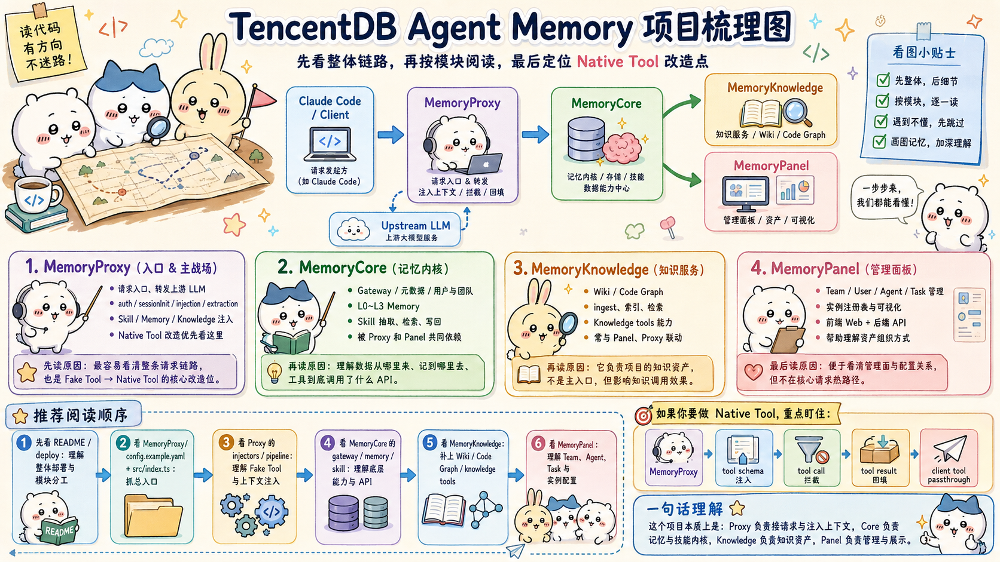
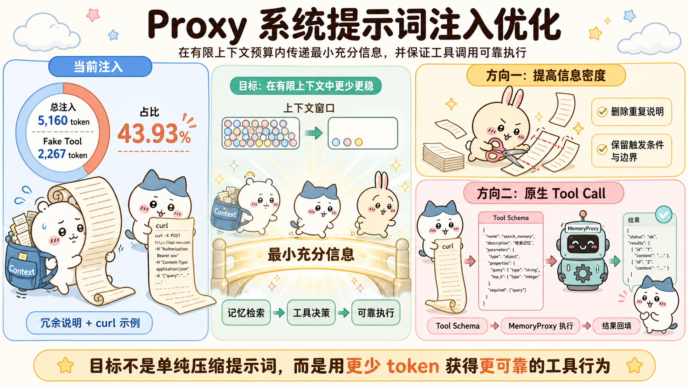
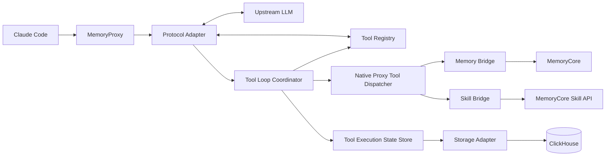

# Tencent-DB-Memory-Project

> TencentDB Agent Memory 课题研究与开发工作区，当前聚焦于任务一“Proxy 系统提示词注入优化”：将基于 Prompt、Bash 与 curl 的 **Fake Tool** 改造为由 MemoryProxy 拦截执行的 **Native Proxy Tool**，并通过可复现的 A/B 实验验证工具行为、Token 成本和端到端延迟。

本目录不是 TencentDB Agent Memory 的单一源码仓库，而是一个用于源码阅读、问题定位、方案验证和 A/B 实验的 Git Superproject。工作区并列保留上游参考源码、固定 Baseline 和 Native 实验分支，并通过独立运行环境观察 MemoryProxy、MemoryCore、MemoryKnowledge 与 MemoryPanel 的完整链路。

当前状态（2026-08-30）：**Native Proxy Tool 执行闭环尚未完成**。Native 分支已经完成正式改造前的协议无损透传、Claude Code Session Init 兼容、代理环境兼容和 ClickHouse 开发环境准备，下一阶段将从单个只读 Memory Tool 的 Anthropic 闭环开始实现。

> **Native / Baseline 工程边界：** `TencentDB-Agent-Memory-Native/` 后续只实现 Native Proxy Tool，不保留原有 Fake Tool，不设计 `fake | native` 双模式或 Fake Tool 回退。Fake Tool 对照由与 Native 项目起点一致、独立保存的 `TencentDB-Agent-Memory-Baseline/` 承担；A/B 实验通过两套独立项目和运行环境完成，而不是在 Native 项目内部切换模式。



## 1. 项目背景

从最直接的系统视角看，本课题主要涉及三个实体：LLM、Coding Agent 客户端和 TencentDB Agent Memory。从 LLM 的视角看，Coding Agent 客户端与 TencentDB Agent Memory 又共同构成了广义的 **Agent Harness**：它们为模型提供环境观测、工具执行和上下文管理等能力，并共同维护 Agent 的运行状态。

Memory 是 Agent Harness 中的重要模块，用于保存和复用跨会话的长期信息，例如个人习惯与偏好、团队规范、项目约定和已经验证过的任务经验。一个完善的 Memory 系统不仅要能从会话中提炼和保存有价值的信息，还需要在合适的时机检索并注入相关记忆。以 Claude Code 为例，许多 Coding Agent 已具备一定的本地或个人记忆能力，但在团队记忆的共享、分发、权限控制和可视化管理方面仍有提升空间。

[TencentDB Agent Memory](https://github.com/Tencent/TencentDB-Agent-Memory) 正是围绕这些问题构建的。系统中的主要模块分工如下：

| 模块 | 主要职责 |
|---|---|
| MemoryCore | 负责 Memory、Skill 等内容的提炼、存储、检索与数据服务 |
| MemoryKnowledge | 提供 Wiki、CodeGraph 等团队知识的构建与检索能力 |
| MemoryPanel | 提供用户、团队、Agent、Task 和记忆资产的可视化管理界面 |
| MemoryProxy | 接入不同 Agent 客户端，并将 Memory、Skill、Knowledge 等能力跨平台注入和共享 |

从应用问题看，TencentDB Agent Memory 试图减少 Agent 使用中的重复劳动：项目背景、用户偏好、团队约定和已经跑通的操作流程，不应在每个新 Session 中重新解释或探索。

系统将可以复用的信息组织为四类记忆资产：

| 资产 | 作用 |
|---|---|
| Chat Memory | 保存事实、偏好、决策和交互历史，并按 L0～L3 逐层提炼 |
| Skill | 从任务与工具调用中提炼可复用的执行流程和验证规则 |
| Wiki | 将文档整理为可搜索、可沿链接下钻的知识页面 |
| CodeGraph | 索引代码文件、符号、调用关系和影响路径 |

这些资产由 Memory Hub 统一管理，再按用户、团队、Agent、权限和当前任务进行装配或召回。项目追求的不是“把所有历史都塞进 Prompt”，而是让 Agent 在需要时拿到正确、足量且有权限使用的信息。

## 2. 当前课题

### 2.1 课题目标

当前选择的是任务一：**Proxy 系统提示词注入优化**。

MemoryProxy 当前会向 Agent 请求注入 Memory、Skill、Knowledge 的工具描述及相关上下文。若仅从表面理解，这项任务是在压缩系统提示词；但从第一性原理出发，真正需要解决的是：

> **如何在有限的上下文预算内，向模型传递完成记忆检索和工具决策所需的最小充分信息，并保证模型产生的工具调用能够被可靠执行。**

因此，本课题的目标不是孤立地追求更短的 Prompt，而是在 Token 成本、信息充分性、工具选择正确性、协议正确性和用户等待时间之间取得平衡。理想状态下，模型应当在确实需要时调用正确工具，在普通编码任务或当前上下文已经充分时不误调用，并让每次调用都形成可以执行、回填和继续推理的完整 Tool Loop。

本文统一使用 **Native Proxy Tool**，指由模型通过原生 Tool Call 协议发起、由 MemoryProxy 拦截并执行的 TencentDB Memory/Skill 工具。核心评测聚焦“模型是否在合适时机选择合适工具”；参数正确率、Tool Loop 完成率和最终任务完成率作为工程可靠性的辅助指标，帮助解释主指标的变化。

### 2.2 核心指标

| 指标 | 目标 | 含义 |
|---|---:|---|
| 有效调用率 | ↑ | 应调用工具时，模型实际发起调用的比例 |
| 误调用率 | ↓ | 普通编码或上下文已经充分时，模型错误调用工具的比例 |
| 工具选择正确率 | ↑ | 需要工具时，是否选中预期的 Memory、Skill，或两侧能力对称时的 Knowledge 工具 |
| 工具描述 Token | ↓ | Baseline 的 Fake Tool 注入块与 Native 的结构化 Tool Definition 各自占用的上下文量 |
| 端到端延迟 | 可接受 | 从评测启动器提交输入到收到最终完整输出的用户侧总耗时 |

辅助指标包括参数正确率、Tool Loop 完成率、结果与 `call_id` 匹配率、Native Proxy Tool 泄漏率、异常恢复率和最终任务完成率。

### 2.3 当前 Fake Tool 机制

当前实现主要把工具调用方法写入系统提示词，让模型复用 Agent 已有的 Bash 能力执行 `curl`：

```text
Injector
  → 系统提示词中的工具说明和 curl 模板
  → 模型选择 Bash
  → Agent 客户端执行 curl
  → MemoryProxy 的 memory-bridge / skill-bridge
  → MemoryCore 或 Knowledge 服务
```

主要注入块如下：

| 注入块 | 当前内容 |
|---|---|
| `<tdai_memory_tools>` | Memory 工具的 curl 模板与调用约束 |
| `<memory-tools-guide>` | 什么情况下应当或不应查询记忆 |
| `<tdai_profile_memory>` | L3 长期画像与 L2 场景索引 |
| `<skill_tools>` | Skill 查询、读取和管理工具的 curl 模板 |
| `<available_skills>` | 当前 Agent 可用或检索命中的 Skill 列表 |
| `<knowledge_tools>` | Wiki、CodeGraph 资源及 `tools/list → tools/call` 使用方法 |

这种方案能在不改 Agent 客户端的情况下工作，但存在明显代价：模板和约束占用较多 Token，模型需要理解 URL、参数、Shell 和错误处理，不同注入块之间也可能存在重复内容。

#### Langfuse 注入 Token 基线

基于当前人工测试会话在 Langfuse 中保存的原始 Generation observation，排除 Claude Code 原始系统提示词、原生工具定义、用户消息和对话历史后，MemoryProxy 的注入构成如下：

| MemoryProxy 注入内容 | Token | 是否计入严格 Fake Tool |
|---|---:|---|
| `<session_context>` | 874 | 否 |
| `<skill_tools>` | 965 | 是 |
| `<available_skills>` 及调用规则 | 472 | 否 |
| `<tdai_memory_tools>` | 1,302 | 是 |
| `<tdai_profile_memory>` | 835 | 否 |
| `<memory-tools-guide>` | 712 | 否 |
| **MemoryProxy 注入总量** | **5,160** |  |
| **严格 Fake Tool 总量** | **2,267** |  |

严格按 `<skill_tools>` 和 `<tdai_memory_tools>` 两个基于 curl 描述的工具块计算：

```text
2,267 / 5,160 = 43.93%
```

同一会话中六个包含完整注入块的 Generation observation 均得到相同结果，注入内容哈希一致。分块 Token 使用 Langfuse 保存的实际 System 内容和 DeepSeek V3 官方 Tokenizer 计算；由于当前 `deepseek-v4-flash` 的分块计数接口不可用，这一结果是当前最接近实际模型口径、可复核的估算，而不是计费级绝对值。



### 2.4 Native Proxy Tool 目标方案

Native 项目将删除 Fake Tool 文本注入与 curl 指南，把 Memory、Skill 能力注册为模型协议中的结构化 Tool Schema。模型只提供 `query`、`limit` 等业务参数；Bridge URL、鉴权、用户、团队和 Agent 身份等可信上下文由 MemoryProxy 根据当前 Session 补充。Native Proxy Tool 继续通过现有 Memory Bridge 与 Skill Bridge 复用身份恢复、权限校验、业务路由和后端访问，不在 Proxy 中重写 MemoryCore 业务逻辑。



一次模型响应按工具归属分为四种情况：

1. 没有 Tool Call：直接返回最终回答；
2. 只有 Claude Code Tool：保持响应原样，由客户端执行；
3. 只有 Native Proxy Tool：MemoryProxy 内部执行，回填 Tool Result，并请求同一上游模型继续推理；
4. 同时包含两类工具：保存完整 assistant 消息，执行 Native Proxy Tool，只向 Claude Code 暴露客户端工具；客户端结果返回后再恢复完整调用轨迹并继续推理。

Provider Server Tool 仍由上游 Provider 执行，MemoryProxy 只负责无损透传。混合并发调用采用“消息骨架 + 有序槽位”：用协议中的唯一 `call_id` 匹配结果，用 `slot_index` 恢复模型生成时的原始顺序，不按工具名称或完成顺序拼接。

客户端看不到被 Proxy 拦截的调用，因此未完成 Tool Loop 需要持久化。上层通过 `ToolExecutionStorageAdapter` 与具体数据库解耦，首期实现可靠读写的 ClickHouse Adapter；该运行状态不能复用现有遥测模块允许丢弃的异步缓冲路径。Context Compression 采用“先补全隐藏历史、再压缩、最后让已被新检查点覆盖的旧记录失效”的顺序。

协议范围限定为 **Anthropic Messages** 与 **OpenAI-compatible Chat Completions**，本课题暂不实现 OpenAI Responses。流式首版采用“完整响应裁决”：MemoryProxy 缓存上游 SSE 到响应结束，确认不含 Native Proxy Tool 时再向客户端回放；若存在 Native Proxy Tool，则在代理内部完成执行和模型重入。完成后再以端到端数据判断是否有必要优化为更复杂的首工具裁决。

### 2.5 范围与实施顺序

当前范围包括 Memory Tool、Skill Tool、Anthropic/OpenAI-compatible 协议、混合工具调用、ClickHouse 状态恢复、Context Compression 补全和 A/B 评测。Knowledge Tool 只有在 Baseline 与 Native 两侧提供等价工具、数据与权限时才进入主评测，否则仅作为扩展实验。

首期明确不做：Native 项目内的 Fake Tool 兼容或回退、MemoryCore/Bridge 业务重写、OpenAI Responses、写入型工具、长期审计、高可用集群，以及未经数据证明有必要的流式优化。

实施按以下顺序收敛推进：

1. 冻结 Baseline、评测口径和少量代表性数据；
2. 完成单个只读 Memory Native Proxy Tool 的 Anthropic 闭环，并移除对应 Fake Tool；
3. 完成混合调用、有序结果归并和 ClickHouse 持久化；
4. 补齐 Memory/Skill 工具、OpenAI-compatible 适配、Compression 重建和 Provider Tool 回归；
5. 实现完整响应裁决，运行 Baseline/Native A/B，再由实验结果决定后续优化。

## 3. 系统结构

| 模块 | 目录 | 主要职责 | 与当前课题的关系 |
|---|---|---|---|
| MemoryProxy | `MemoryProxy/` | 接收和转发模型请求；鉴权、Session Init、上下文注入、Bridge、观测与协议适配 | **课题主战场**，Native Proxy Tool 的注入、拦截、回填和重入主要在此实现 |
| MemoryCore | `MemoryCore/` | Memory/Skill 数据面、提炼、存储、检索、用户与团队元数据 | 提供 Native Proxy Tool 最终调用的业务能力与 API |
| MemoryKnowledge | `MemoryKnowledge/` | Wiki、CodeGraph 的构建、索引、检索和 Knowledge Tools | 提供知识资产与工具能力 |
| MemoryPanel | `MemoryPanel/` | Team、User、Agent、Task 和资产的管理与可视化 | 用于准备、检查和绑定实验资产，不在核心请求链路中 |

高层请求关系：

```text
Claude Code / 其他 Agent
          ↕
      MemoryProxy  ↔  Upstream LLM
          ↕
       MemoryCore  ↔  MemoryKnowledge
          ↕                 ↕
               MemoryPanel
```

MemoryProxy 的 Context Injection 内部先将 OpenAI/Anthropic 请求转换为协议无关的 `AgentContext`，再执行 Hook，最后序列化回原协议：

```text
Raw Request
  → Protocol Adapter.parse()
  → AgentContext
  → HookRegistry 按优先级执行 InjectionHook
  → AnchorTarget / InjectionPoint 注入
  → Protocol Adapter.serialize()
  → Upstream LLM
```

其中 `AgentContext` 统一承载消息、工具、请求参数和运行时元数据；`InjectionHook` 描述注入内容、位置、优先级和缓存策略；`tools.append` / `tools.prepend` 已为 Native Proxy Tool Schema 注入提供了基础坐标。当前框架已经具备“注入结构化工具”的抽象，但 Tool Call 返回后的拦截、执行、结果回填和模型重入仍需实现。

本课题会扩展现有 Protocol Adapter、Bridge、Handler 和存储装配，不新建平行的协议或 Handler 体系。新增职责保持窄而清晰：

| 组件 | 目标职责 |
|---|---|
| Protocol Adapter | 在 Anthropic/OpenAI-compatible 协议与统一内部 Tool 表示之间无损转换 |
| Tool Registry | 记录工具名称、Schema、归属、执行方式和副作用属性 |
| Native Proxy Tool Dispatcher | 将结构化调用映射到 Memory Bridge 或 Skill Bridge |
| Tool Loop Coordinator | 负责响应分流、执行、结果归并、模型重入和循环限制 |
| Tool Execution State Store | 管理未完成 Tool Loop、消息骨架、有序槽位和 Compression 检查点 |
| Storage Adapter | 隔离数据库实现，首期使用 ClickHouse |

## 4. 工作区目录

根目录是私有 Git Superproject，统一管理研究文档、问题记录、图片、版本锁和 Lab 符号链接。三套源码以 submodule 固定到明确 commit；Lab 使用独立私有仓库管理可复用运维资产，根仓库只记录其符号链接和锁定版本。

| 路径 | 版本管理 | 定位与使用原则 |
|---|---|---|
| [`TencentDB-Agent-Memory/`](TencentDB-Agent-Memory/) | 官方仓库 submodule，固定 `97f9465` | 上游参考源码，用于阅读实现和比较后续变化 |
| [`TencentDB-Agent-Memory-Baseline/`](TencentDB-Agent-Memory-Baseline/) | 私有 submodule，`baseline/bugfix-sync`，固定 `41306b1` | A/B 固定基线；仅包含两侧共用修复并保留原始 Fake Tool，此后冻结 |
| [`TencentDB-Agent-Memory-Native/`](TencentDB-Agent-Memory-Native/) | 私有 submodule，`research/native-tool`，固定 `6728810` | 课题实现目录；只实现 Native Proxy Tool，不保留 Fake Tool 双模式或回退 |
| [`eval_kit/`](eval_kit/) | 根仓库内的 TypeScript 工具 | 统一管理数据准备、Skill/Memory 导入、A/B 用例运行、指标计算和结果查看 |
| [`tencentdb-memory-lab`](tencentdb-memory-lab) | 符号链接 + 独立私有仓库，版本见 `workspace.lock.yaml` | 可复用脚本、文档和脱敏模板进入 Git；配置、凭据、数据、日志和会话历史留在运行环境 |
| [`手稿/`](手稿/) | 课题说明、会议纪要、代码阅读笔记与图解 | 研究背景和设计依据 |
| [`issues/`](issues/) | 已脱敏的问题、复现、根因、验收条件和上游协作记录 | 问题档案与修复证据 |
| [`开发和日常使用.md`](开发和日常使用.md) | 当前机器上的服务、端口、调试和 A/B 操作手册 | 本地日常开发入口，包含环境相关信息 |

Baseline 与 Native 从同一版本起点分离，并使用独立端口、配置、数据、日志、Claude 配置目录和 Session。这样既能控制实验变量，也能避免 Claude Code 自身上下文或记忆污染前后对比。Baseline 的 tracked 源码保持冻结；Native 的 `nativeProxyTools.enabled=false` 只表示关闭 Native Proxy Tool，不会回退到 Fake Tool。

### 4.1 新机器恢复

```bash
git clone --recurse-submodules \
  https://github.com/177-Liukuan/Tencent-DB-Memory-Project.git
cd Tencent-DB-Memory-Project
```

随后按照 [`workspace.lock.yaml`](workspace.lock.yaml) 将 Lab 私有仓库克隆到 `/storage1/liukuan/tencentdb-memory-lab`，检出其中锁定的 commit，并在根目录不存在同名路径时创建符号链接：

```bash
git clone https://github.com/177-Liukuan/TencentDB-Memory-Lab.git \
  /storage1/liukuan/tencentdb-memory-lab
git -C /storage1/liukuan/tencentdb-memory-lab checkout \
  e0e0d74d8c3b2e52dd3509bf0e4fab5c13103b11
if [ ! -e tencentdb-memory-lab ] && [ ! -L tencentdb-memory-lab ]; then
  ln -s /storage1/liukuan/tencentdb-memory-lab tencentdb-memory-lab
fi
```

真实 secrets、运行数据和 systemd 配置不属于 Git，需要通过安全渠道单独恢复。若 Lab 目标或根目录链接已经存在，应先检查其内容和指向，不要直接覆盖。

### 4.2 日常版本更新

1. 先在源码子仓库或 Lab 中提交并推送变更。
2. 回到根仓库，更新对应 submodule gitlink；Lab 更新则同步修改 `workspace.lock.yaml` 中的 commit。
3. 在根仓库提交并推送工作区版本变化。

根仓库采用“默认跟踪、按风险排除”的 `.gitignore`。以后在根目录新增普通代码目录时，文件会自动出现在 `git status` 中；如果新目录自身包含 `.git`，必须明确决定将其注册为 submodule，不能把嵌套仓库意外加入工作区。

## 5. 当前进展

### 5.1 已完成

- 在 Ubuntu 24.04 和 Node.js 22 环境完成源码部署与基础配置；
- 打通 Claude Code、Anthropic 兼容上游与 TencentDB Agent Memory 的请求链路；
- 隔离 Baseline 与 Native 两套运行环境，并准备统一 Seed 和独立 Session；
- 部署 Langfuse，能够按 `baseline` / `native` 环境观察 Trace；
- 阅读 Context Injection、协议 Adapter、各类 Injector、Bridge、Session Init 和响应处理代码；
- 记录并向上游提交 Anthropic Server Tool 无损透传问题；
- 记录 thinking 历史与 Claude Code Session Init 伪造表单的兼容问题；
- 在 Native 分支完成相关回归测试、基础兼容修复和批量测试启动器；
- 在 Baseline 同步与工具机制无关、保证 A/B 可比性的必要兼容修复，此后冻结 Baseline；
- 复用服务器现有 ClickHouse，为 Native 开发环境创建独立数据库并完成 SDK CRUD、迁移、重启和健康检查验证。

Native 分支上完成的基础提交（与工具机制无关的部分已同步到 Baseline，以保持实验可比）：

| Commit | 内容 | 状态 |
|---|---|---|
| `6cb876d` | 保留 Anthropic Server Tool 的 `type`、`max_uses` 等原生字段，避免伪造空 `input_schema` | 自动化测试通过，真实 Claude Code Web Search 已验证 |
| `e9b3758` | 保留供应商 thinking 历史，并在转发上游前剔除 Proxy 生成的 Session Init 表单伪历史 | 自动化测试通过，问题档案记录为待新 Session 完整复测 |
| `b6414c7` | 加载项目 `undici` 时保留 Node 环境代理 Dispatcher，避免外部模型请求绕过环境代理 | 自动化测试覆盖 |
| `2c89868` | 保留 Memory/Skill Bridge 的回环 URL，避免被外部代理地址覆盖 | 自动化测试覆盖 |
| `6728810` | 增加可预选 Team、Agent、Task 的无头 Claude Code 批量启动器 | Shell 自动化测试覆盖 |

问题详情：

- [Anthropic Server Tool 注入往返字段丢失](issues/2026-08-22-memoryproxy-anthropic-server-tool-roundtrip.md)
- [thinking 历史块与 Session Init 兼容问题](issues/2026-08-22-memoryproxy-thinking-history-990.md)
- [问题状态总表](issues/README.md)

### 5.2 待实现

- 单个只读 Memory Native Proxy Tool 的 Anthropic 端到端闭环；
- Tool Registry、Dispatcher、Tool Loop Coordinator 与集中配置；
- 混合调用的消息骨架、有序槽位和 `call_id` 结果归并；
- 可靠读写的 ClickHouse Tool Execution Storage Adapter；
- 全量 Memory/Skill Tool、OpenAI-compatible 适配和 Context Compression 历史补全；
- 完整 SSE 响应裁决，以及 Baseline/Native 数据集和 A/B 评测。

## 6. 本地基础设施

当前 Baseline/Native 两套运行环境、Langfuse 和 ClickHouse 已可用于后续开发与实验。Native 环境复用本机现有 ClickHouse `25.12.11.4` 服务进程，但使用独立数据库 `tdai_native_tools`，不读写 Langfuse 自身数据库和表。认证信息只保存在 `tencentdb-memory-lab/native/secrets/proxy.yaml`，不写入源码或本文档。

现有 ClickHouse 配置、`@clickhouse/client` 连接、临时表 CRUD、MemoryProxy 启动迁移和服务健康检查均已验证。Native Proxy Tool 状态表尚未提前创建，将在数据结构确定后由 `ClickHouseToolExecutionStorageAdapter` 的初始化或迁移负责创建。

当前复用方式仅用于本机开发和实验；正式部署或独立 CI 应使用独立 Endpoint 或受限账号，避免 Native Proxy Tool 的可用性与 Langfuse 生命周期绑定。Tool Loop 运行状态必须使用独立、可等待、可读取和可幂等更新的可靠路径，不能复用现有 ClickHouse 遥测模块允许丢弃的异步批量写入队列。

## 7. 本地开发与 A/B 实验

完整操作以 [`开发和日常使用.md`](开发和日常使用.md) 为准。下面只保留最短入口，不在 README 中复制密钥、账号和机器地址。

### 7.1 健康检查

```bash
cd /home/liukuan/Tencent-DB-Memory-Project
./tencentdb-memory-lab/bin/health-check
```

运行环境包含 Baseline/Native 各五个服务：MemoryCore、MemoryKnowledge、MemoryPanel Backend、Panel Web 和 MemoryProxy。正常情况下十个健康检查均返回 `200`。

### 7.2 Native 开发

```bash
cd /home/liukuan/Tencent-DB-Memory-Project/TencentDB-Agent-Memory-Native
git branch --show-current
git status --short
git diff
```

源码修改只进入 Native。修改 TypeScript 后需要重启受影响的 Native 服务；不确定影响范围时：

```bash
systemctl --user restart 'tdam-native-*.service'
/home/liukuan/Tencent-DB-Memory-Project/tencentdb-memory-lab/bin/health-check
```

### 7.3 人工与批量测试

交互式人工测试直接启动 Claude Code，并在首次进入时选择 Team、Agent 和 Task：

```bash
cd /home/liukuan/Tencent-DB-Memory-Project
./tencentdb-memory-lab/bin/claude-native
```

`-p/--print` 会禁用 Claude Code 的 `AskUserQuestion`，因此全新 Session 不能依赖交互表单完成资产绑定。Native 非交互与批量测试应使用专用启动器，通过 MemoryProxy 已有的请求头预选机制绑定 Team、Agent 和 Task：

```bash
export TDAI_TEAM_ID='<team-id>'
export TDAI_AGENT_ID='<agent-id>'
export TDAI_TASK_ID='<task-id>'

./tencentdb-memory-lab/bin/claude-native-batch \
  --team-id "$TDAI_TEAM_ID" \
  --agent-id "$TDAI_AGENT_ID" \
  --task-id "$TDAI_TASK_ID" \
  '请先调用 TDAI Memory 工具，查询我过去与健身相关的历史记忆，并根据实际查询结果回答。'
```

启动器默认每次生成独立 Session，并以 JSON 输出单次结果，适合在 Shell 循环中执行固定数据集：

```bash
while IFS= read -r prompt; do
  ./tencentdb-memory-lab/bin/claude-native-batch \
    --team-id "$TDAI_TEAM_ID" \
    --agent-id "$TDAI_AGENT_ID" \
    --task-id "$TDAI_TASK_ID" \
    "$prompt"
done < prompts.txt
```

该启动器适合链路验证，但正式 A/B 还需要给 Baseline 与 Native 使用同一评测驱动和统一结果格式。每条主评测样本至少包含：

```json
{
  "case_id": "memory-positive-001",
  "query": "我之前和你约定的这个项目代码规范是什么？",
  "should_call": true,
  "expected_tool": "tdai_memory_search"
}
```

主评测集同时包含应调用 Memory/Skill 的正样本和不应调用 MemoryProxy 工具的负样本；并发、混合调用、错误和恢复 Case 单独放入工程可靠性集。Knowledge 只有在两套环境能力对称时才进入主统计。

前后对比必须固定模型、参数、上下文上限、输入、资产快照、身份权限、Claude Code 版本和启动参数；主动变量仅为 Fake Tool 与 Native Proxy Tool 机制。每个 Case 使用隔离工作目录和新 Session，冻结或重置会被写入的 Memory/Skill 数据，并交替或随机执行两套方案。Langfuse 通过 `environment=baseline` / `environment=native` 区分模型请求与工具链路；端到端延迟由 Agent 外部的评测启动器记录。

正式结果至少报告有效调用率、误调用率、工具选择正确率、工具描述 Token、端到端延迟的均值/中位数/P95，以及失败和超时数量。每轮还需保存代码 Commit、数据集、模型、工具定义、配置摘要和 Tokenizer 版本，保证实验可复现。

### 7.4 定向验证

```bash
cd TencentDB-Agent-Memory-Native/MemoryProxy
npm test
npm run typecheck

cd ../MemoryCore
npm test
```

先运行与改动相关的定向测试，再运行对应组件全量测试。真实协议、Session Init、Provider Server Tool、混合 Tool Call、重启恢复和 Context Compression 等行为仍需使用全新 Claude Code Session 做端到端验证。

## 8. 研究资料索引

### 课题与方案

- [`Native Tool课题目标与技术实施方案（内部）.md`](Native%20Tool课题目标与技术实施方案（内部）.md)：当前 Native Proxy Tool 的范围、架构、工程决策、实施顺序和评测基线；后续开发以此为准。
- [`手稿/参与的课题.题目介绍.md`](手稿/参与的课题.题目介绍.md)：两个正式课题、指标、方向和交付物。
- [`手稿/任务一梳理.md`](手稿/任务一梳理.md)：任务一的早期边界、Fake/Native 两条路线、评测方法和导师建议。
- [`手稿/8.21_对齐课题背景_腾讯元宝会议纪要.md`](手稿/8.21_对齐课题背景_腾讯元宝会议纪要.md)：课题对齐会议的摘要与转写。
- [`手稿/进展梳理.md`](手稿/进展梳理.md)：系统理解、路线选择和阶段性进度。

### 代码阅读与问题

- [`手稿/TencentDB Agent Memory：injection-types.ts 阅读笔记.md`](手稿/TencentDB%20Agent%20Memory：injection-types.ts%20阅读笔记.md)：Context Injection 领域模型和完整数据流解读。
- [`手稿/读代码的过程发现的问题.md`](手稿/读代码的过程发现的问题.md)：源码阅读过程中发现的问题摘要。
- [`issues/`](issues/)：可公开复现的问题、修复证据和上游协作状态。

### 上游项目文档

- [中文项目介绍](TencentDB-Agent-Memory-Native/README_CN.md)
- [中文安装指南](TencentDB-Agent-Memory-Native/INSTALL_CN.md)
- [源码部署说明](TencentDB-Agent-Memory-Native/README.deployment.md)
- [路线图](TencentDB-Agent-Memory-Native/ROADMAP_CN.md)
- [贡献指南](TencentDB-Agent-Memory-Native/CONTRIBUTING_CN.md)
- [MemoryProxy 文档](TencentDB-Agent-Memory-Native/MemoryProxy/README.md)
- [MemoryKnowledge 文档](TencentDB-Agent-Memory-Native/MemoryKnowledge/README.md)

## 9. 安全与实验纪律

- 不提交或展示 `*.key`、Secret、Token、密码、原始用户标识和未经脱敏的 Trace；
- 运行配置、数据库、Seed 和日志不进入源码提交；
- 日志可能包含 Prompt，只能保存完成复现所需的最小脱敏片段；
- 不修改 Baseline 的 tracked 源码，不允许 Baseline 与 Native 串用端口或数据；
- 不手工编辑运行中的 SQLite 数据库，使用 API 或 Seed 恢复；
- 执行 Seed 恢复前先保存本轮实验结果；
- 问题档案必须记录版本、最小复现、根因证据、验收条件和验证状态；
- 文档中要区分“已自动化验证”“已人工验证”“待复测”和“规划中”，避免把阶段性方案写成已完成能力。

## 10. AI Agent 协助运行程序的长期通用约定

当刘宽要求“运行、启动、部署、重启或帮我把程序跑起来”时，AI Agent 默认完成整个运行闭环，而不是只给一条命令。该约定适用于本工作区及后续其它项目，不限于 TencentDB Agent Memory。

标准顺序如下：

1. **先确认环境**：阅读项目 README、运行手册和现有脚本，核对代码路径、分支/版本、依赖、端口、已有进程、数据目录和可用资源；能够从机器上确认的信息不再反问用户。
2. **先给出命令和简要注释**：命令使用可复制的代码块，说明每条命令的作用、运行目录和必要前提；涉及停止服务、覆盖配置、清理数据或外部访问时明确影响。
3. **代为运行**：用户明确要求“帮我运行/启动”即授权在该程序范围内执行正常启动操作。优先复用项目已有的 `systemd`、Docker Compose、启动脚本或 `screen`，不另造一套并行运行方式。
4. **验证真实可用**：启动后检查进程/服务状态、监听端口、健康接口和关键日志；不能只看到 PID 或 `active` 就宣称成功。若失败，先定位根因，再给出和执行最小修复。
5. **交付使用方法**：说明如何访问或调用程序、浏览器 URL、账号/凭据的安全查询路径、日志位置，以及查看状态、重启和停止的命令。需要从 Windows 访问服务器回环端口时，提供可直接复制的 PowerShell SSH 端口转发命令。
6. **长任务可恢复**：训练、下载、批处理等长任务应放入项目约定的后台管理工具（默认优先 `screen` 或现有服务管理器），并报告会话名、日志和重新进入方法。

长期安全约束：

- 不在回复、README、命令示例或日志摘要中暴露 API Key、Token、密码和私有凭据，只说明凭据文件或安全查询方式；
- 不停止或改动无关服务，不使用宽泛的 `pkill`，端口冲突时先识别占用者；
- 不覆盖用户已有修改、运行数据或配置；`purge`、删除数据、重置数据库等破坏性操作必须另行获得明确授权；
- 启动结果必须以当次新鲜检查为依据，并明确区分“服务器端已验证”和“仍需用户在本地验证”的部分。

用户可用下面的简写触发这一流程：

```text
请帮我在 <项目路径> 运行 <程序或服务>：先给出带简要注释的命令，然后代为启动并验证，最后告诉我访问、日志、重启和停止方法。
```

---

本 README 描述的是当前课题工作区，而非上游项目的替代文档。若要部署或使用 TencentDB Agent Memory 产品本身，请优先阅读子项目的 [`README_CN.md`](TencentDB-Agent-Memory-Native/README_CN.md) 与 [`INSTALL_CN.md`](TencentDB-Agent-Memory-Native/INSTALL_CN.md)。
