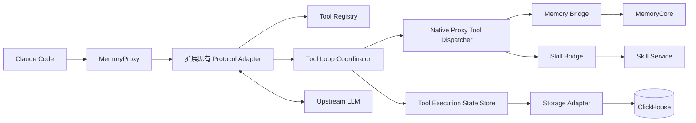

# Native Proxy Tool 课题目标与技术实施方案（内部）

> 更新时间：2026-08-30  
> 状态：已完成导师对齐，作为后续开发、测试与复盘的内部实施基线  
> 原则：优先完成正确、可评测的最小闭环，不提前引入与课题目标无关的复杂设计

> 术语约定：本文统一使用 **Native Proxy Tool**，指由模型通过原生 Tool Call 协议发起、由 MemoryProxy 拦截并执行的 TencentDB Memory/Skill 工具。

## 1. 课题背景与核心目标

当前 MemoryProxy 通过 System Prompt 描述工具，并引导模型使用 Bash 和 curl 调用 Memory Bridge、Skill Bridge。这种 Fake Tool 方案能够复用现有业务能力，但存在两类主要问题：

1. 工具名称、参数、调用示例和大量 curl 说明占用较多上下文；
2. 工具调用依赖模型生成自然语言命令，参数传递、执行和结果识别不够结构化。

根据 Langfuse 的初步统计，当前一次典型请求中：

| 统计项 | Token 数量 | 占 MemoryProxy 注入提示词比例 |
| --- | ---: | ---: |
| MemoryProxy 注入提示词总量 | 5,160 | 100% |
| Fake Tool 相关内容 | 2,267 | 43.93% |

本课题的目标不是单纯压缩 Prompt，而是：

> 在有限的上下文预算内，向模型提供完成记忆检索和工具决策所需的最小充分信息，并保证模型产生的工具调用能够被 MemoryProxy 可靠执行、回填和继续推理。

最终需要同时完成两项工作：

- 工程实现：将 Memory、Skill 的 Fake Tool 改造为模型原生 Native Proxy Tool，形成完整 Tool Loop；
- 量化评测：使用统一任务数据集，对 Baseline Fake Tool 与 Native Proxy Tool 进行 A/B 对比。

## 2. 已确认的范围与原则

### 2.1 两套项目的职责

- **Baseline 项目**：保留与 Native 项目起点一致的原始 Fake Tool 实现，只用于 A/B 测试；
- **Native 项目**：直接移除 Fake Tool 注入和 curl 使用指南，不保留兼容开关或双轨逻辑，避免实现被历史方案牵制。

本课题不在 Native 项目中实现 Fake Tool 回退路径。需要对比两种方案或继续使用原始 Fake Tool 时，直接运行不做工具改造的 Baseline 项目。Native 项目中的 Native Proxy Tool 总开关关闭时，仅表示不注入和执行 Native Proxy Tool，不会重新启用 Fake Tool。

### 2.2 首期工具范围

Native Proxy Tool 最终覆盖现有 Memory 与 Skill 能力：

- Memory Tool 通过 Memory Bridge 调用既有 MemoryCore 能力；
- Skill Tool 通过 Skill Bridge 调用既有 Skill 服务能力。

Bridge 已经负责身份恢复、权限校验、服务端鉴权、业务路由和后端访问。Native Proxy Tool 不重复实现这些业务逻辑，而由 MemoryProxy 负责结构化工具的注册、拦截、分流、执行编排和结果回填。

模型只能提供 `query`、`limit` 等业务参数，不能指定 Bridge URL、鉴权信息、`user_id`、`team_id` 或最终执行的 `agent_id`。可信身份和 Session 上下文由 MemoryProxy 补充。

### 2.3 首期不做的事情

- 不在 Native 项目中保留 Fake Tool 兼容模式；
- 不重写 MemoryCore、Memory Bridge 或 Skill Bridge 已有业务逻辑；
- 不把写入型工具、计费、长期审计和高可用集群作为最小闭环的前置条件；
- 不主动改造项目现有的通用 Context Compression、Memory 沉淀和 Skill 提取机制，只处理 Native Proxy Tool 隐藏历史带来的必要补充；
- 不在正确性尚未验证前过早优化流式延迟。

## 3. 目标架构



核心组件的职责如下：

| 组件 | 职责 |
| --- | --- |
| Protocol Adapter | 扩展现有 `injection/adapters`，解析和生成 Anthropic、OpenAI-compatible 协议并转换为统一内部结构 |
| Tool Registry | 保存工具名称、Schema、归属、执行方式和副作用属性 |
| Native Proxy Tool Dispatcher | 根据注册表将 Native Proxy Tool 映射到 Memory Bridge 或 Skill Bridge |
| Tool Loop Coordinator | 负责分流、执行、结果归并、模型重入和循环限制 |
| Tool Execution State Store | 管理未完成 Tool Loop、消息骨架、有序槽位和压缩检查点 |
| Storage Adapter | 隔离具体数据库实现，首期默认使用 ClickHouse |

## 4. 关键问题与最终决定

### 4.1 并发工具调用下的顺序记录与结果归并

同一轮模型响应可能同时包含 Native Proxy Tool 与 Claude Code Tool。MemoryProxy 在分流执行时必须保留原始 assistant 消息及其 content block 顺序，不能根据工具完成顺序动态拼接结果。

采用“**消息骨架 + 有序槽位**”方案：

1. Protocol Adapter 无损解析完整 assistant 消息；
2. 每个 Tool Call 建立一个槽位，记录 `call_id`、`slot_index`、`owner`、输入和状态；
3. Native Proxy Tool 结果由 MemoryProxy 填入，Client Tool 结果在 Claude Code 后续请求返回时填入；
4. 使用 `call_id` 精确匹配结果，使用 `slot_index` 恢复模型原始顺序；
5. 所有必要结果到齐后，按消息骨架重建完整 `tool_use + tool_result` 轨迹并继续请求模型。

例如模型依次产生：

```text
slot 0: memory_search  id=P1  owner=proxy   result=?
slot 1: Bash("ls")     id=C1  owner=client  result=?
slot 2: Bash("pwd")    id=C2  owner=client  result=?
slot 3: memory_search  id=P2  owner=proxy   result=?
```

即使结果按 `P1 → P2 → C2 → C1` 到达，最终仍按 `P1 → C1 → C2 → P2` 重建。工具结果只按 ID 归属，不按工具名称或完成顺序匹配。

Anthropic 的 `tool_use.id / tool_use_id` 和 OpenAI 的 `tool_calls[].id / tool_call_id` 进入 Proxy 后统一表示为内部 `call_id`。建议使用 `space_id + user_id + agent_source + session_id + context_version + tool_batch_id + call_id` 定位调用；`turn_seq` 用于排序和观测，不单独承担全局唯一性。

### 4.2 Native Proxy Tool 调用历史的持久化与存储适配

Native Proxy Tool 在 MemoryProxy 内部被拦截执行，其调用与结果对 Claude Code 不可见。混合调用可能跨越两次客户端请求，因此只依赖客户端消息或进程内变量，无法满足导师提出的重启恢复、请求间隔和后续替换内部存储的要求。

最终采用分层设计：

```text
Tool Loop Coordinator
        │
        ▼
Tool Execution State Store
        │
        ▼
ToolExecutionStorageAdapter
        │
   ┌────┴────────────┐
   ▼                 ▼
ClickHouse       Internal Storage
```

- Tool Execution State Store 提供业务语义，例如创建工具批次、保存消息骨架、按 `call_id` 填充结果、读取未完成轮次和标记压缩覆盖范围；
- `ToolExecutionStorageAdapter` 负责具体存储读写；
- 第一阶段实现 `ClickHouseToolExecutionStorageAdapter`；可复用现有 ClickHouse 配置、鉴权和客户端装配能力，但不能复用当前面向用量遥测的异步批量写入队列；
- 后续内部环境需要其他数据库时，增加新 Adapter，不修改 Tool Loop 主流程。

ClickHouse 是当前默认实现，但不是写死的唯一方案。这里的 Adapter 是 Native Proxy Tool 领域内的窄接口，不替代项目已有的 `ProxyStorage`、Factory 和 Repo 体系；实现时应优先复用其中可满足要求的配置、装配和隔离模式，避免再建立一套通用存储框架。

Tool Loop 状态属于协议正确性所依赖的关键运行状态，不能采用现有 ClickHouse 遥测模块的 best-effort、内存缓冲和允许丢弃语义。状态创建、结果回填和检查点更新必须等待写入成功，并支持读取、幂等写入、条件更新和明确的失败返回；存储不可用时不得静默降级到进程内状态。首期只保存重建闭环所需的最小字段，并配置 TTL 或逻辑过期。若后续需要长期审计，应单独设计审计数据，而不是无限保留运行态记录。

#### 当前开发与测试环境

截至 2026-08-30，服务器已经运行 ClickHouse `25.12.11.4`。为避免重复部署，当前 Native 开发环境复用 Langfuse 管理的 ClickHouse 服务进程，但使用独立数据库 `tdai_native_tools`，不读写 Langfuse 自身数据库和表：

- HTTP Endpoint：`http://127.0.0.1:8123`，仅监听本机回环地址；
- Native Proxy 本地配置：`tencentdb-memory-lab/native/secrets/proxy.yaml`，其中凭据只保存在本地 secrets 目录，不写入源码或方案文档；
- 已启用现有 ClickHouse 配置，并成功创建 `usage_logs`、`usage_raw`、`session_init_logs` 和 `tool_call_logs`；
- 已使用 MemoryProxy 当前依赖的 `@clickhouse/client` 完成临时表的创建、插入、查询和删除测试；
- Native Proxy 重启后，启动日志显示连接检查通过、23 项迁移全部成功，服务健康检查正常。

因此，后续开发 `ClickHouseToolExecutionStorageAdapter` 时可以直接复用现有 Endpoint、认证配置和 SDK，不需要重新下载 ClickHouse。Native Proxy Tool 的状态表目前尚未提前创建，应由 Adapter 的初始化或迁移逻辑在表结构确定后负责创建。

当前复用方式只用于本机开发和实验。正式部署或独立 CI 环境应提供独立 ClickHouse Endpoint 或受限账号，避免让 Native Proxy Tool 的可用性与 Langfuse 生命周期绑定。无论使用哪个实例，状态 Adapter 都必须走独立可靠读写路径，不能调用现有 `clickhouse.ts` 的遥测缓冲队列。

### 4.3 Context Compression 下的历史重建与失效

Claude Code 触发 Context Compression 时，客户端历史不包含被 Proxy 隐藏的 Tool Call 与 Tool Result。如果直接使用客户端历史生成摘要，LLM 实际经历过的工具信息可能缺失；如果直接清理 Proxy 历史，又会失去补全压缩上下文的机会。

采用“**先重建、再压缩、最后失效旧历史**”的顺序：

```text
Claude Code History
        +
Persisted Native Proxy Tool History
        ↓
Context Reconstruction
        ↓
Complete Logical Context
        ↓
Context Compression
        ↓
Compact Summary / New Context Checkpoint
```

具体规则：

1. 识别到压缩请求后，从 State Store 读取本次压缩范围内的 Native Proxy Tool 记录；
2. 使用与混合调用相同的消息骨架和槽位机制，恢复完整逻辑历史后再交给压缩模型；
3. 压缩成功并确认新的 Context Checkpoint 后，只将已被该检查点覆盖且已完成闭环的旧记录标记为失效；
4. `pending` 状态的 Tool Call、未被压缩覆盖的近期记录继续保留；
5. 后续请求从新的 `context_version` 继续记录，不能把已进入摘要的原始记录重复注入。

这里的失效表示“不再参与后续上下文重建”，不等于必须立即物理删除。首期可通过状态字段和 TTL 完成回收。

### 4.4 Proxy 到模型侧适配 Anthropic 与 OpenAI 两种协议

MemoryProxy 需要支持 Anthropic Messages 与 OpenAI-compatible Chat Completions。为避免实现两套 Tool Loop，协议差异统一收敛到 Protocol Adapter：

| 统一概念 | Anthropic | OpenAI-compatible |
| --- | --- | --- |
| Tool Schema | `tools[]` | `tools[].function` |
| Tool Call | `tool_use` | `tool_calls[]` |
| Tool Result | `tool_result` | `role=tool` |
| Call ID | `tool_use.id` | `tool_calls[].id` |

Tool Registry、Dispatcher、State Store 和 Tool Loop Coordinator 只处理统一内部结构。重新提交模型时，再由对应 Adapter 编码为目标协议。

为控制实现风险，开发顺序上先扩展当前 Claude Code 主链路使用的 Anthropic Adapter，再复用同一内部模型扩展现有 OpenAI Adapter；两者均属于课题最终范围，但不要求同时起步开发。本课题当前不实现 OpenAI Responses Adapter，也不把 Responses 协议纳入本轮 Native Proxy Tool 的验收范围。

### 4.5 Native Proxy Tool 改造后的任务评测

Native Proxy Tool 减少了 curl 说明并提高了调用结构化程度，但删除 Fake Tool 中显式、重复的使用引导后，模型对 Memory、Skill 等工具的关注程度和实际调用率也可能下降。因此不能预设 Native Proxy Tool 一定更好，必须通过同条件 A/B 实验回答“Token 是否下降、工具行为是否保持正确、端到端等待时间是否可接受”。

#### 4.5.1 评测目标

评测聚焦以下四个问题：

1. 任务需要 Memory、Skill 或纳入评测范围的 Knowledge Tool 时，模型是否主动产生工具调用；
2. 任务不需要这些工具时，模型是否避免受到工具描述干扰而误调用；
3. 多类工具同时可用时，模型是否选择正确工具；
4. 在保持调用能力的前提下，Native Proxy Tool 是否显著降低工具描述 Token，并保持可接受的端到端延迟。

评测的主要对象是“是否在合适时机选择合适工具”，无需一开始构造成完整软件工程 Benchmark。Tool Loop 完成率、参数正确率和最终任务完成率作为工程可靠性的辅助指标单独统计。

#### 4.5.2 数据集与标签

每条主评测样本至少包含：

```json
{
  "case_id": "memory-positive-001",
  "query": "我之前和你约定的这个项目代码规范是什么？",
  "should_call": true,
  "expected_tool": "tdai_memory_search"
}
```

- `query`：发送给 Agent 的原始测试问题；
- `should_call`：是否应该触发 MemoryProxy 管理的工具；
- `expected_tool`：预期工具的稳定注册名；负样本使用 `null`；
- `case_id`：用于关联两套方案、重复运行结果和 Langfuse Trace。

可按需要增加 `tool_family`、`difficulty`、`asset_fixture` 和 `expected_tools` 等字段，但不改变上述最小标签。主评测集分为：

- **正样本**：必须借助 Memory、Skill 或对称提供的 Knowledge Tool 才能正确回答，包括显式请求和需要模型自行识别历史约定、团队 SOP、知识资产的隐式请求；
- **负样本**：只依赖模型自身知识或 Claude Code 原生工具即可完成，包括与“记忆、技能、知识”等词语表面相关、实际上无需调用工具的困难负例。

用于验证并发、混合调用、参数错误、无结果和异常恢复的 Case 另设“工程可靠性集”，不与单工具选择数据混算。若同一 Case 允许多个正确工具，必须使用 `expected_tools` 明确其集合，并在评测前确定严格匹配规则。

Knowledge Tool 只有在 Baseline 与 Native 两套环境中提供等价工具、数据和权限时才能进入主要 A/B 统计；如果本轮 Native 改造尚未覆盖 Knowledge，则相关样本只进入扩展实验，不得与 Memory/Skill 主结果混合，以免比较双方不对称的工具集合。

先使用小规模样本校准标签、资产和采集程序，再扩充正式数据集。正负样本及各工具类别应尽量均衡，并同时报告总体结果和按工具类别拆分的结果，避免样本分布掩盖某一类工具的退化。

#### 4.5.3 核心指标

**1. 有效调用率（Effective Tool Call Rate）**

在 `should_call = true` 的样本中，模型至少产生一次 MemoryProxy 管理的目标工具体系调用即记为“已调用”。调用了错误工具仍计入已调用，但会在工具选择正确率中判错：

$$
R_{call}=\frac{N_{called}}{N_{positive}}
$$

该指标越高越好，用于判断改造后模型是否仍能识别“什么时候需要工具”。

**2. 误调用率（False Tool Call Rate）**

在 `should_call = false` 的样本中，只要出现 MemoryProxy 管理的工具调用即记为误调用：

$$
R_{false}=\frac{N_{false}}{N_{negative}}
$$

该指标越低越好，用于识别 Tool Description 或 Tool Schema 是否对普通任务造成过强诱导。

**3. 工具选择正确率（Tool Selection Accuracy）**

在已经产生工具调用的正样本中，实际工具与 `expected_tool` 一致，且没有额外调用其他不应调用的 MemoryProxy 工具，才记为选择正确：

$$
A_{tool}=\frac{N_{correct\_tool}}{N_{tool\_call}}
$$

该指标必须与有效调用率一起解读，避免“只在少数样本调用、但条件正确率很高”造成误判。多工具 Case 按预先定义的 `expected_tools` 集合规则单独统计。

**4. 工具描述 Token**

在工具集合、Session 配置和协议格式固定时，分别从 Langfuse 中选取 Baseline 与 Native 的完整上游请求，并使用同一 Tokenizer 统计：

- Baseline：System Prompt 中 `<tdai_memory_tools>`、`<memory-tools-guide>`、`<skill_tools>`、`<knowledge_tools>` 等实际存在的 Fake Tool 注入块；
- Native：请求 `tools` 字段中新注入的 Native Proxy Tool Definition 与 JSON Schema。

记两者为 $T_{baseline}$ 与 $T_{native}$：

$$
Reduction_{token}=\frac{T_{baseline}-T_{native}}{T_{baseline}}\times100\%
$$

只有在序列化后的工具相关内容逐请求保持一致时才统计一次；若工具数量、Schema、用户权限或动态工具目录发生变化，应按唯一工具集合版本重新统计，并记录对应版本或哈希。总输入 Token 可作为辅助指标，但不能替代工具描述本身的独立统计。

**5. 端到端延迟（End-to-End Latency）**

Fake Tool 的部分执行发生在 Claude Code，Native Proxy Tool 的执行和模型重入发生在 MemoryProxy，局部组件计时边界不同，因此统一从 Agent 外部测量：

$$
L_{e2e}=T_{final}-T_{input}
$$

其中 $T_{input}$ 是评测启动器提交输入的时间，$T_{final}$ 是收到最终完整输出的时间。对同一个 Case 成对记录 $L_i^{Fake}$ 和 $L_i^{Native}$，重复执行后报告均值、中位数和 P95，并计算平均延迟变化率：

$$
\Delta L_{\%}=\frac{\overline{L}^{Native}-\overline{L}^{Fake}}{\overline{L}^{Fake}}\times100\%
$$

该差值代表用户实际感受到的整体变化，不将其严格解释为某一个内部组件的纯耗时。超时和失败 Case 必须单独计数，不能从延迟统计中静默删除。

辅助指标包括参数正确率、Tool Loop 完成率、结果与 `call_id` 匹配率、Native Proxy Tool 泄漏率、异常恢复率和最终任务完成率，用于解释主要指标发生变化的具体原因。

#### 4.5.4 控制变量与采集要求

- 使用相同后台模型、模型参数、上下文上限、Claude Code 版本和启动参数；
- Baseline 与 Native 使用同一份评测数据、资产快照、身份、权限和后端服务；
- 每个 Case 使用独立 Claude Code Session 和独立工作目录，避免客户端本地 Memory 与历史上下文串扰；
- 评测期间冻结或重置会被写入的 Memory/Skill 数据，避免前一次运行改变后续样本；
- 固定冷缓存或热缓存策略；无法固定时分别记录，不把两种状态混合汇总；
- 两套方案交替或随机顺序运行，在相近时间窗口内完成成对测量，降低网络和模型负载漂移；
- 同一 Case 视波动情况重复运行，保留全部原始结果，并记录超时、失败和重试；
- Langfuse 负责保存模型请求、Generation 和工具调用链路；端到端时间由评测启动器从 Agent 外部记录；
- 每次实验保存代码 Commit、模型标识、数据集版本、工具定义版本、配置摘要和 Tokenizer 版本，保证结果可复现。

评测顺序为：先完成 Native Proxy Tool 最小闭环和少量 Case 的采集校准，再运行第一轮 Baseline/Native A/B；不把所有扩展功能完成作为首轮评测前置条件。

## 5. Native Proxy Tool 执行闭环

### 5.1 请求准备

1. 完成 Session Init、身份恢复和模型路由；
2. 从 Tool Registry 取得 TDAI Tool Schema；
3. 检查客户端工具是否与 TDAI 保留命名空间冲突；
4. 通过 Protocol Adapter 将 TDAI Schema 合并到客户端原有 `tools`；
5. 保存本轮实际使用的 `system`、`tools`、模型参数和上游目标，供内部模型重入复用。

### 5.2 响应分流

上游响应完成归属判断后，按四种情况处理：

1. **没有 Tool Call**：直接返回最终回答；
2. **只有 Claude Code Tool**：保持协议响应原样，由客户端执行；
3. **只有 Native Proxy Tool**：MemoryProxy 内部执行，构造完整 Tool Result，并在同一请求内继续模型推理；
4. **混合 Tool Call**：保存完整 assistant 消息和有序槽位，先执行 Native Proxy Tool，只向 Claude Code 暴露客户端工具；客户端结果回来后按 `call_id` 填槽，完整重建并继续模型推理。

Provider Server Tool 由上游 Provider 执行，MemoryProxy 不接管其业务执行。Protocol Adapter 应无损保留 Provider 相关协议块和元数据，避免把它误判为 Native Proxy Tool 或 Claude Code Tool。

### 5.3 模型重入

内部模型重入时：

- 追加原始完整 assistant 消息和对应的完整 Tool Result 消息；
- 复用第一次请求已完成注入的 `system`、`tools`、模型参数和实际成功的上游目标；
- 不重复执行 Session Init、Injection Pipeline 和模型路由；
- 为每个用户输入维持一个 Langfuse Trace，每次模型调用记录为独立 Generation。

### 5.4 错误与边界

- Tool Registry 中的工具名必须使用稳定的 `snake_case`，Tool Schema 与执行器使用同一个名称；Schema 应完整声明必填字段、类型、枚举、范围、默认值、长度和未知字段策略；
- 模型产生的工具参数必须先通过 JSON Schema 或 Zod 校验，校验成功后才能进入 Native Proxy Tool Dispatcher；模型不得通过参数覆盖身份、Bridge URL、Header 或鉴权信息；
- 参数错误、Bridge 业务错误、超时等可恢复异常转换为结构稳定且带错误标记的 Tool Result，例如只包含 `code`、`message`、`request_id` 和 `retryable`，由模型决定重试或解释；
- Tool Result 和日志不得包含原始异常栈、上游完整响应、Authorization、API Key、服务端 Token 或其他凭据；未知异常只返回通用错误和关联 ID；
- 未知 `call_id`、重复结果、消息骨架损坏等协议错误由 MemoryProxy 直接拒绝；
- 设置最大工具轮数、单轮调用数、累计调用数、工具超时和结果大小；
- 只对网络错误、超时、429 和可恢复 5xx 等瞬时异常按配置重试；Schema、权限和其他 4xx 错误不自动重试；
- 第一阶段优先支持现有只读工具；未来引入写入型工具时，再增加副作用、幂等和串并行策略。

### 5.5 集中配置

Native Proxy Tool 的开关、循环限制、超时、结果大小和状态存储统一进入 MemoryProxy 现有配置体系，不允许由 Dispatcher、Executor 或 Adapter 自行读取环境变量或创建全局配置。初步配置结构如下：

```yaml
nativeProxyTools:
  enabled: true
  maxRounds: 5
  maxCallsPerRound: 8
  maxTotalCalls: 20
  toolTimeoutMs: 5000
  maxResultBytes: 65536
  stateTtlSeconds: 1800
  stateStorage:
    backend: clickhouse
    table: native_proxy_tool_execution_state
```

配置文件使用 `camelCase`，并延续 MemoryProxy 的 `CLI > YAML > DEFAULT_CONFIG` 优先级。实现每个配置项时必须同步完成 TypeScript 类型、默认值、解析与范围校验、`config.example.yaml` 和 README 说明；ClickHouse URL、用户名和密码继续复用现有 `clickhouse` 配置，不在 `nativeProxyTools` 中重复保存。Native 项目中 `enabled: false` 只关闭 Native Proxy Tool，不回退到 Fake Tool。

## 6. 流式响应策略

当前 `ReadableStream.tee()` 的客户端分支会立即透传 SSE，后台分支只能观察 Tool Call，无法在工具泄漏前完成拦截。Native Proxy Tool 首版采用“完整响应裁决”：MemoryProxy 成为上游 SSE 的唯一消费者，缓存到 `message_stop` 后判断本轮工具归属。

- 不含 Native Proxy Tool：向 Claude Code 回放合法 SSE；
- 含 Native Proxy Tool：代理内部消费本轮响应、执行工具并进入模型重入；
- 重入后的最终回答或纯客户端工具响应再返回 Claude Code。

该方案优先建立协议正确性基线。完成后使用 Langfuse 和端到端测试比较其与原始 Fake Tool 的 TTFT、工具启动延迟和总耗时。如果差距较小且人工体验基本无感，则保留这一简单方案；只有延迟明显不可接受时，才考虑“前缀缓冲 + 首工具裁决”等更复杂优化。

## 7. 最小数据模型

```ts
type JsonPrimitive = string | number | boolean | null;
type JsonValue = JsonPrimitive | JsonValue[] | { [key: string]: JsonValue };

type ToolOwner = "proxy" | "client" | "provider";
type ToolCallStatus = "pending" | "running" | "succeeded" | "failed";

interface ToolCallSlot {
  callId: string;
  slotIndex: number;
  toolName: string;
  owner: ToolOwner;
  input: JsonValue;
  status: ToolCallStatus;
  result?: JsonValue;
  isError?: boolean;
}

interface ToolExecutionStateKey {
  spaceId: string;
  userId: string;
  agentSource: string;
  sessionId: string;
  contextVersion: string;
  toolBatchId: string;
}

interface UpstreamRequestSnapshot {
  protocol: "anthropic" | "openai";
  upstreamTargetId: string;
  modelId: string;
  system?: JsonValue;
  tools?: JsonValue[];
  requestParams: { [key: string]: JsonValue };
}

interface ToolExecutionContext {
  key: ToolExecutionStateKey;
  turnSeq: number;
  protocol: "anthropic" | "openai";
  assistantSkeleton: JsonValue;
  slots: ToolCallSlot[];
  upstreamSnapshot: UpstreamRequestSnapshot;
  revision: number;
  expiresAt: string;
}

interface ToolExecutionStorageAdapter {
  create(context: ToolExecutionContext): Promise<void>;
  findByCallId(
    key: ToolExecutionStateKey,
    callId: string,
  ): Promise<ToolExecutionContext | null>;
  compareAndSetSlotResult(
    key: ToolExecutionStateKey,
    callId: string,
    expectedStatus: ToolCallStatus,
    result: JsonValue,
    isError: boolean,
  ): Promise<boolean>;
  markCoveredByCheckpoint(
    key: Omit<ToolExecutionStateKey, "toolBatchId">,
    checkpointVersion: string,
  ): Promise<number>;
}
```

这只是首期最小语义接口。`call_id` 负责结果匹配，`ToolExecutionStateKey` 负责租户、用户、Session、上下文版本和工具批次隔离；所有读取和更新都必须验证可信 Session 身份。`compareAndSetSlotResult` 用于阻止重复结果和并发覆盖。ClickHouse 的具体表结构、版本记录和 TTL 由 Adapter 内部处理，不向 Tool Loop 泄漏数据库细节。

`assistantSkeleton` 必须保留协议重建所需的 content block，但持久化前应执行大小限制和敏感字段过滤；`upstreamSnapshot` 只保存白名单字段，不得包含请求 Header、API Key、Authorization 或可反推出凭据的完整上游配置。Langfuse 和普通日志默认只记录工具名、调用 ID、状态、耗时和结果大小，不记录完整输入、结果或消息骨架。

## 8. 代码改造边界

新实现应扩展已有 Protocol Adapter、Bridge、Handler 和存储装配，不新建平行的协议或 Handler 体系。建议按以下边界新增或调整模块，所有新增 Node 后端文件使用 `kebab-case.ts`：

```text
src/
├── injection/adapters/
│   ├── interface.ts                     # 扩展现有 ProtocolAdapter
│   ├── anthropic.ts                     # 扩展现有 Anthropic Adapter
│   └── openai.ts                        # 扩展现有 OpenAI Adapter
├── native-proxy-tools/
│   ├── types.ts
│   ├── tool-registry.ts
│   ├── native-proxy-tool-dispatcher.ts
│   ├── tool-loop-coordinator.ts
│   └── __tests__/
├── memory/
│   └── memory-bridge.ts                 # 复用现有实现
├── skill/
│   └── skill-bridge.ts                  # 复用现有实现
├── db/
│   ├── tool-execution-storage-adapter.ts
│   └── clickhouse-tool-execution-storage-adapter.ts
├── anthropicHandler.ts                  # 保持现有路径，仅接入编排器
└── handler.ts                           # 保持现有路径，仅接入编排器
```

现有模块的主要变化：

- Injection Pipeline：删除 Fake Tool 文本注入，仅保留仍有必要的非工具上下文；
- 现有 Protocol Adapter：在原接口和实现上增加响应、SSE、Tool Call 与 Tool Result 的无损转换能力，不复制另一套 Adapter；
- 现有 Anthropic/OpenAI Handler：保持文件路径与外部路由不变，只把 Native Proxy Tool 相关编排委托给 Tool Loop Coordinator；
- Bridge：保持现有业务职责，只补充 Native Proxy Tool Dispatcher 所需的稳定接口和错误映射；
- ClickHouse 状态 Adapter：使用独立表和可靠读写路径，不复用用量遥测的 best-effort 批处理；
- Langfuse：记录每次 Generation、工具执行、延迟、Token 和最终任务结果，生产默认不记录完整工具输入、结果或消息骨架。

## 9. 实施顺序

### 阶段一：冻结基线与测试口径

- 确认 Baseline 不再修改；
- 固定模型、参数、身份、任务输入和 Langfuse 统计口径；
- 先建立少量代表性任务与 Ground Truth。

### 阶段二：完成单一 Native Proxy Tool 闭环

- 建立统一内部 Tool 类型和 Tool Registry，扩展现有 Anthropic Adapter；
- 注入一个只读 Memory Native Proxy Tool；
- 通过 Memory Bridge 执行并完成 Tool Result 回填与模型重入；
- 删除 Native 项目对应 Fake Tool 注入；
- 将 Native Proxy Tool 开关、限制和状态存储参数接入现有集中配置体系。

### 阶段三：完成混合调用与持久化

- 实现消息骨架和有序槽位；
- 实现使用独立可靠读写路径的 ClickHouse Storage Adapter；
- 支持 Native Proxy Tool 与多个 Claude Code Tool 的结果归并；
- 验证重启、超时、重复结果和错误返回。

### 阶段四：补齐完整课题范围

- 接入全部 Memory Tool 与 Skill Tool；
- 扩展现有 OpenAI Protocol Adapter；
- 支持 Context Compression 前的历史重建和检查点失效；
- 完成 Provider Tool 无损透传验证。

### 阶段五：流式与 A/B 评测

- 实现完整响应裁决；
- 测量其相对 Fake Tool 的延迟影响；
- 扩展任务数据集并运行 Baseline/Native 对比；
- 根据实验结果决定是否需要进一步流式优化或提示词补强。

## 10. 验收标准

### 10.1 工程验收

- Native 项目不再注入 Fake Tool 和 curl 指南；
- Memory、Skill Tool 均以结构化 Tool Schema 提供；
- Native Proxy Tool 不会泄漏给 Claude Code；
- Client Tool 与 Provider Tool 的既有行为不被破坏；
- 纯 Native Proxy Tool、纯 Claude Code Tool、混合调用均形成协议完整的 Tool Loop；
- 多个同名工具和乱序完成结果可以按 `call_id` 正确归并；
- 服务重启后可从 ClickHouse 恢复未完成的混合工具轮次；
- Compression 能先补全隐藏历史，再建立新检查点；
- Anthropic 与 OpenAI-compatible 上游均通过核心测试。

### 10.2 评测验收

- 数据集包含明确的 `case_id`、`query`、`should_call` 和 `expected_tool` Ground Truth，并区分主评测集与工程可靠性集；
- Baseline 与 Native 使用同一任务集、模型配置、资产快照、身份权限和缓存口径，Knowledge 等工具只在两侧能力对称时进入主统计；
- 能稳定统计有效调用率、误调用率、工具选择正确率、工具描述 Token、端到端延迟及必要的工程辅助指标；
- 端到端延迟由 Agent 外部成对采集，报告均值、中位数、P95、失败数和超时数；
- 能解释 Native Proxy Tool 的收益、退化和失败类型，而不是只报告平均 Token 降幅；
- 实验脚本、原始结果、数据集、代码 Commit、配置摘要、模型和 Tokenizer 版本均可追溯、可复现。

## 11. 当前结论

本课题采用一条明确且收敛的实施路线：

> 在 Native 项目中移除 Fake Tool，由 MemoryProxy 通过 Protocol Adapter、Tool Registry、Tool Loop Coordinator 和 Bridge Executor 接管真实工具调用；使用消息骨架与有序槽位处理混合并发调用，通过可替换的 Storage Adapter 将隐藏工具状态持久化到 ClickHouse；在 Context Compression 前补全逻辑历史；最后以统一任务数据集对 Baseline 与 Native 进行 A/B 评测。

首要目标是先证明 Native Proxy Tool 闭环正确、稳定、可评测。任何额外抽象或性能优化，都应由实际测试结果驱动。
